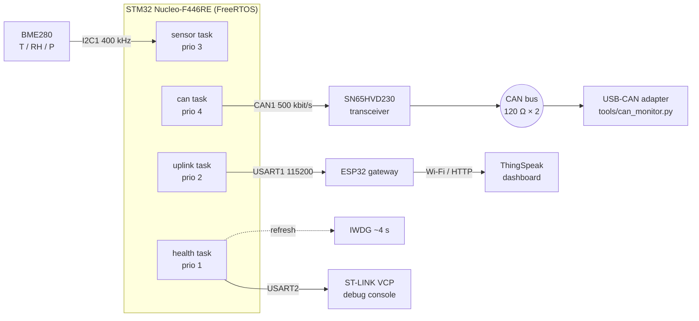
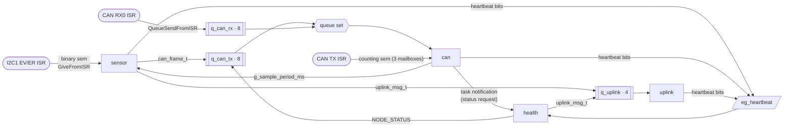

# Architecture

## System overview

## Tasks and kernel objects

| Task | Prio | Stack | Blocks on | Responsibility |
|------|------|-------|-----------|----------------|
| `can` | 4 | 256 w | queue set (`q_can_tx` + `q_can_rx`), 500 ms timeout | Sole owner of bxCAN TX; parses commands |
| `sensor` | 3 | 384 w | `xTaskDelayUntil` (default 1 s); I2C completion semaphore | BME280 forced-mode sampling, fan-out to CAN + uplink |
| `uplink` | 2 | 384 w | `q_uplink`, 500 ms timeout | Checksummed ASCII lines to ESP32 over USART1 |
| `health` | 1 | 384 w | task notification, 1 s timeout | Heartbeat supervision, IWDG, status frames, diagnostics |

### Why these priorities

- **CAN highest** — a received command should be acted on within one tick, and the
  TX path only does short, bounded work (copy into a mailbox).
- **Sensor above uplink** — acquisition timing must not depend on a slow or
  disconnected Wi-Fi gateway. The uplink formats strings and waits ~5 ms per line on
  the UART, so it runs below.
- **Health lowest** — it is the canary. If any higher-priority task spins, health is
  starved, stops refreshing the IWDG, and the MCU resets.

## Synchronisation primitives, and why each one

| Primitive | Where | Reason |
|-----------|-------|--------|
| Binary semaphore | `i2c_bus.c`, `uart_port.c` | ISR → task "transfer complete" signal. The task sleeps during the transfer instead of busy-waiting. |
| Mutex | console UART, uplink UART, I2C bus | Mutual exclusion with **priority inheritance** — a low-priority logger holding the console can't indefinitely block a higher-priority task (bounded priority inversion). A binary semaphore would not give inheritance. |
| Counting semaphore (max 3) | `can_bus.c` | Mirrors the three bxCAN TX mailboxes; taken per frame, given back by TX-complete/abort ISRs. |
| Queues | `q_can_tx`, `q_can_rx`, `q_uplink` | Copy-by-value hand-off between tasks and from ISRs (`xQueueSendFromISR`). |
| Queue set | CAN task | Wait on TX and RX queues at once without polling. |
| Direct task notification | CAN → health | Lightest-weight "wake up now" signal; no kernel object needed. |
| Event group | heartbeats | Each task sets its own bit; health reads-and-clears all bits atomically with `xEventGroupClearBits`. |

## Interrupt priorities

STM32F4 implements 4 NVIC priority bits (`NVIC_PRIORITYGROUP_4`). Any ISR that calls
a FreeRTOS `…FromISR()` API must be numerically **≥ `configLIBRARY_MAX_SYSCALL_INTERRUPT_PRIORITY` (5)**;
violating this is one of the most common FreeRTOS-on-Cortex-M bugs and shows up as
random corruption of kernel lists. `configASSERT` in `port.c` catches it in debug builds.

| IRQ | Priority | Calls into FreeRTOS |
|-----|----------|---------------------|
| CAN1_RX0 | 6 | `xQueueSendFromISR` |
| CAN1_TX, CAN1_SCE | 7 | `xSemaphoreGiveFromISR` |
| I2C1_EV, I2C1_ER | 8 | `xSemaphoreGiveFromISR` |
| USART1, USART2 | 9 | `xSemaphoreGiveFromISR` |
| TIM6 (HAL tick) | 15 | — |
| SysTick / PendSV | 15 (kernel) | scheduler |

FreeRTOS owns SysTick, so the HAL timebase (`HAL_Delay`, driver timeouts) runs from
TIM6 — see `Core/Src/hal_timebase_tim6.c`.

## Fault handling and recovery

| Fault | Detection | Response |
|-------|-----------|----------|
| BME280 absent / NACK | `bme280_init` / I2C error callback | Retry every period; `SENSOR_OK` flag cleared |
| I2C bus stuck | Completion semaphore timeout | `HAL_I2C_DeInit` + `Init` (peripheral reset pulse) |
| 3 failed measurements | Counter in sensor task | Full sensor re-init |
| No ACK on CAN / bus-off | TX credit timeout | Abort pending mailboxes; hardware auto bus-off recovery; logged once per outage |
| Task hung | Missed heartbeat deadline | Health task withholds IWDG refresh → reset in ~4 s → `WDT_RESET` flag on next boot |
| Stack overflow / malloc fail / assert | FreeRTOS hooks | `board_fatal()`: IRQs off, fast LED blink, IWDG reset |
| HSE missing | `HAL_RCC_OscConfig` fails | Fall back to HSI, set `HSI_FALLBACK` flag (CAN timing marginal) |
| Hard fault | Cortex-M fault handlers | CFSR/HFSR/MMFAR/BFAR saved to globals for the debugger, then IWDG reset |

## Memory budget (Debug build, arm-none-eabi-gcc 13.3)

| Region | Used | Of |
|--------|------|----|
| Flash | ~37 KB | 512 KB |
| RAM | ~37 KB | 128 KB (32 KB of it is the FreeRTOS heap) |

The health task logs per-task stack high-water marks every 30 s so the stack sizes in
`app.h` can be tightened from real measurements.
