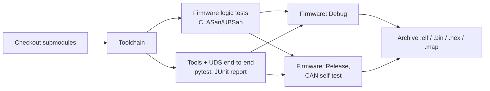

# Running the Jenkins pipeline locally

The repository has two CI setups that run the same checks:

| | GitHub Actions | Jenkins |
|---|---|---|
| Definition | `.github/workflows/ci.yml` | `Jenkinsfile` (declarative pipeline) |
| Runs | automatically on every push to GitHub | on any Jenkins controller; the steps below set one up on your laptop |

## What the pipeline does



| Jenkinsfile block | What it means |
|---|---|
| `agent any` | Run on any available executor; the tools come from the Jenkins image built below. |
| `environment { TOOLCHAIN = ... }` | Variables exported to every `sh` step. |
| `options { timestamps(); timeout(...); buildDiscarder(...) }` | Timestamped logs, abort runaway builds after 30 min, keep the last 20 builds. |
| `triggers { pollSCM('H/15 * * * *') }` | Poll GitHub about every 15 minutes (`H` spreads the load). A webhook replaces this when Jenkins is reachable from the internet. |
| `parallel { ... }` | The C and Python test stages run at the same time, as do the two firmware builds. |
| `junit '...xml'` | Publishes pytest results, giving per-test history and trend graphs. |
| `post { success { archiveArtifacts ... } }` | Keeps the firmware images with each build, fingerprinted so you can trace which build produced a binary. |

## 1. Start Jenkins (Docker)

Requires Docker Desktop (Windows/macOS) or Docker Engine (Linux).

```bash
git clone https://github.com/Ankita-Experi/freertos-iot-env-monitor.git
cd freertos-iot-env-monitor

docker build -t envmon-jenkins ci/jenkins
docker run -d --name envmon-jenkins -p 127.0.0.1:8080:8080 \
           -v envmon-jenkins-home:/var/jenkins_home envmon-jenkins
```

The image is the official `jenkins/jenkins:lts-jdk17` plus the ARM toolchain,
CMake, Python/pytest and the plugins in `ci/jenkins/plugins.txt`.

## 2. Unlock Jenkins

1. Open <http://localhost:8080>.
2. Paste the initial admin password:
   ```bash
   docker exec envmon-jenkins cat /var/jenkins_home/secrets/initialAdminPassword
   ```
3. Choose **Select plugins to install → None** (the needed plugins are already in the image).
4. Create your admin user.

## 3. Create the pipeline job

1. **New Item** → name it `freertos-iot-env-monitor` → **Pipeline** → OK.
2. Under **Pipeline**, set **Definition** to **Pipeline script from SCM**.
3. **SCM:** Git. **Repository URL:** `https://github.com/Ankita-Experi/freertos-iot-env-monitor.git`
4. **Branch Specifier:** `*/main`. **Script Path:** `Jenkinsfile`.
5. **Save**, then **Build Now**.

The first run takes a few minutes (it fetches the STM32 HAL and FreeRTOS
submodules). Then open the build to see:

- **Stage View**: the stages and their timings, with the parallel branches side by side.
- **Test Result**: the pytest results, including the UDS end-to-end tests.
- **Build Artifacts**: `env_monitor.elf`, `.bin`, `.hex` and `.map` for both variants.
- **Console Output**: the timestamped log, including the flash/RAM usage report.

## 4. Things worth trying

- Break a unit test (for example, change an expected NRC in `firmware/stm32/test/test_diag.c`)
  and push it: the build turns red at **Unit tests** and the firmware stages never run.
- Add `-DCMAKE_C_FLAGS=-Werror` to a firmware build to make warnings fail the pipeline.
- Replace `pollSCM` with a GitHub webhook (needs a public URL, e.g. via a tunnel).
- Move the toolchain into a Docker agent (`agent { dockerfile true }`) so builds don't depend on the controller.

## Stopping and cleaning up

```bash
docker stop envmon-jenkins            # keeps jobs and history in the volume
docker start envmon-jenkins
docker rm -f envmon-jenkins && docker volume rm envmon-jenkins-home   # remove everything
```
